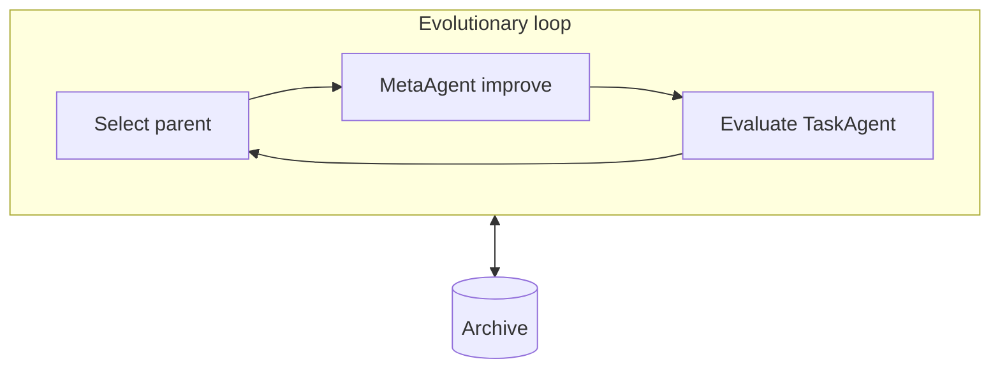
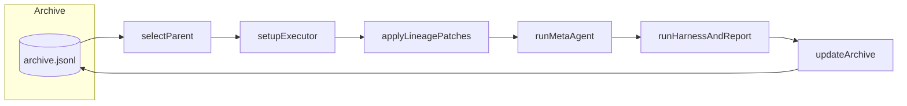
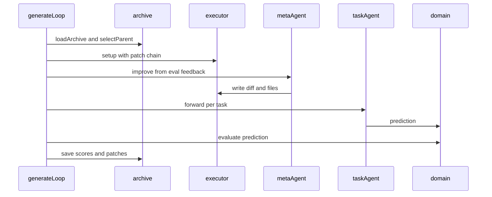
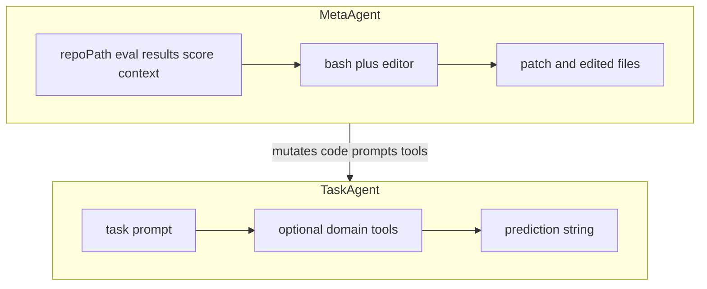
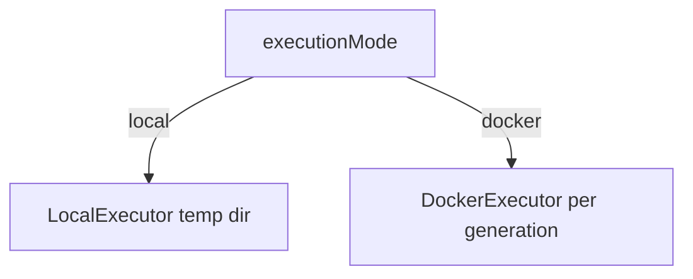
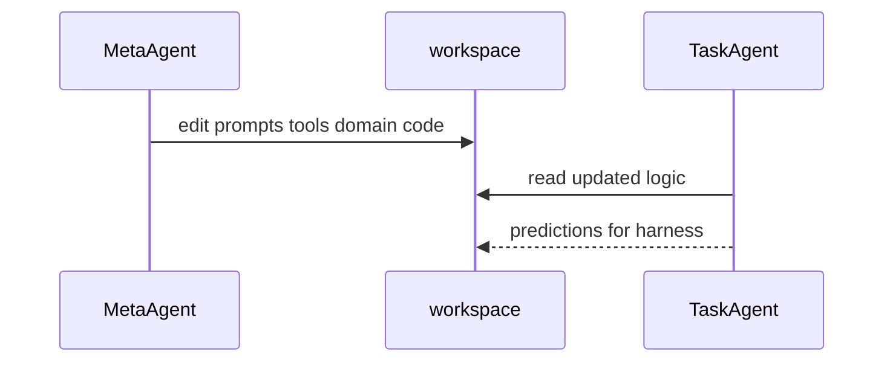
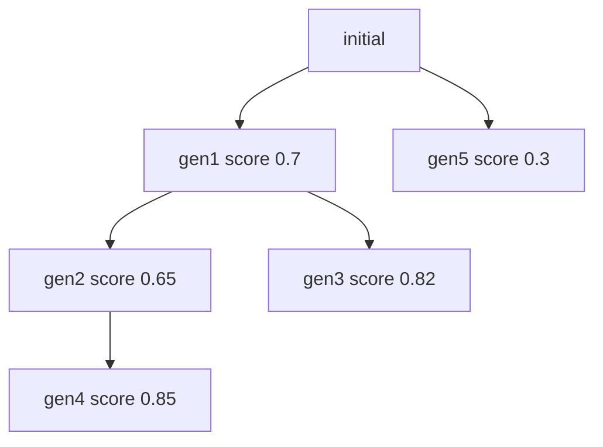
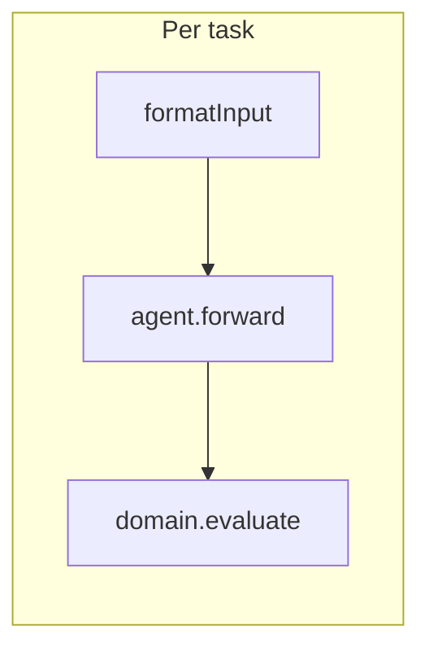
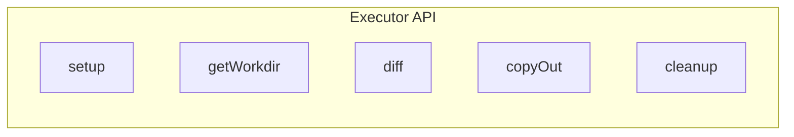
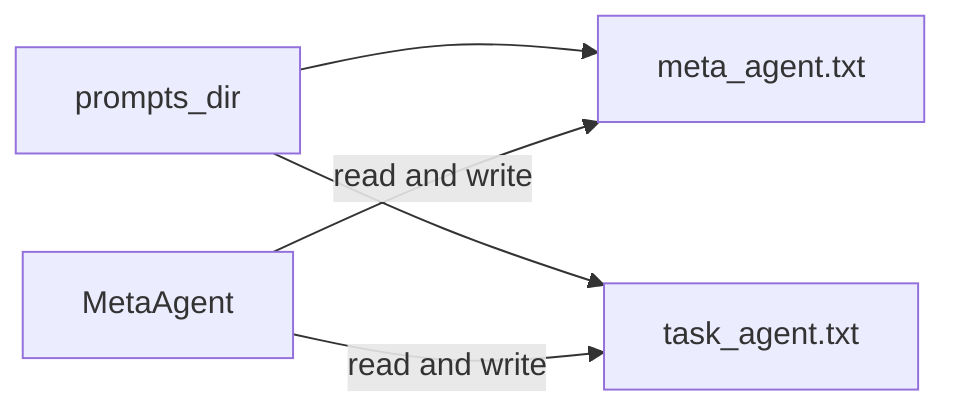

# Basic concepts

HyperFlow is a self-improving agent framework. Instead of manually tuning an AI agent, you let another AI agent do it automatically.

The core idea comes from **evolutionary computation** and **Quality-Diversity** style archives: keep many agent versions, score them, and use strong ancestors as parents for the next **mutation** (the MetaAgent edits code). **Workflow diagrams** below match this narrative so you can read in one place.

## Overview

## Workflow diagrams

### Evolutionary loop (outer)

### One generation (sequence)

Use participant id **`Main`** (not `Loop`) — Mermaid reserves `loop` for control blocks.

### TaskAgent vs MetaAgent (programs)

### Execution mode

## The two agents

### TaskAgent — the worker

The TaskAgent solves domain-specific tasks. It receives a formatted prompt, optionally uses tools, and returns a prediction.

- **Input**: A task description (formatted by the domain harness).
- **Output**: A prediction.
- **Tools**: Domain-specific, optional.

### MetaAgent — the improver

The MetaAgent is the **mutation operator**. HyperFlow treats an agent as a **computable program**, so the MetaAgent can refine logic, prompts, tools, and strategies on disk (**metacognitive self-modification**).

- **Input**: Repo path, evaluation results, parent score context.
- **Output**: Patches / modified source files.
- **Tools**: Built-in `bash` and `editor`.

### How they cooperate

## The evolutionary loop

The loop (see `generate_loop.py`) runs generations until `max_generations` or early stop. Each generation typically:

1. **Select parent** from the archive (`select_parent.py`).
2. **Set up executor** (local or Docker).
3. **Apply lineage** — replay patches so the workspace matches the parent.
4. **Run MetaAgent** — produce a new patch from failures and context.
5. **Run TaskAgent** through the **harness** (staged eval may run first if configured).
6. **Evaluate** — domain scores predictions; reports under the output directory.
7. **Update archive** — append a JSONL snapshot with scores and patch paths.

## The archive

The archive is an append-only **JSONL** file: each line is a full snapshot. Read the **last line** for current state. Lineage is a **tree**: `parent_id` points to the real ancestor, not necessarily the latest id.

### Why JSONL?

| | JSON | JSONL |
| --- | --- | --- |
| Structure | One object per file | One object per line |
| Append | Rewrite file | Append line |
| Latest state | Parse all | Read last line |
| Typical use here | `report.json`, `predictions.json` | `archive.jsonl` |

## Parent selection strategies

Chosen **once** in config for the whole run (`select_parent.py`):

| Strategy | Behavior |
| --- | --- |
| `random` | Uniform over valid parents — max exploration |
| `latest` | Most recent valid parent — simple chain |
| `best` | Highest score — pure exploitation |
| `score_prop` | Random weighted by score |
| `score_child_prop` | Score-weighted with **child penalty** (default) |

**Why not always `best`?** You can get stuck in a **local maximum**. Child penalty uses: **`weight = (score + 0.01) × 1 / (1 + num_children)`**.

## Domains and evaluation

A **Domain** defines your benchmark: load tasks, format input, evaluate predictions, and report aggregates. **Evaluators** in `evaluators.py` include `static_evaluator`, `llm_judge_evaluator`, and `human_feedback_evaluator`. The **harness** (`harness.py`) runs the TaskAgent over tasks.

## The harness

## Predictions vs scores

| | Score | Prediction |
| --- | --- | --- |
| What | Number from 0 to 1 | Model output string |
| Typical files | `report.json` | `predictions.json` |
| Used for | Parent selection, ranking | User-facing output, debugging |

## Executors

`executor.py` provides **LocalExecutor** (fast, dev) and **DockerExecutor** (sandboxed via `docker.py`).

## Self-referential improvement (`prompts_dir`)

Editable prompt files let the MetaAgent change its own instructions over generations:

- `meta_agent.txt`
- `task_agent.txt`

## Early termination

- Best archive score **1.0** stops the loop.
- The MetaAgent receives score context so it avoids needless edits when already passing.

## Examples overview

| Example | Focus |
| --- | --- |
| Bash | Command generation |
| Scoring | Grading / prompts |
| Calculator | Tool code fixes |
| Fact-check | Classification |
| Paper review | Accept / reject |
| Git evolution | Patch lineage |

See [Examples](./examples.md) for commands.

## Glossary

| Term | Definition |
| --- | --- |
| Archive | JSONL history of generations and scores |
| Domain | Task suite + evaluation |
| Evaluator | static / LLM judge / human |
| Executor | Local or Docker workspace per generation |
| Harness | Runs TaskAgent over domain tasks |
| MetaAgent | Edits code to improve TaskAgent |
| Parent | Archive node used as base for a child |
| Patch | Diff from MetaAgent |

---

**Next steps**

- [Advanced concepts](./advanced-concepts.md)
- [Limitations](./limitations.md)
